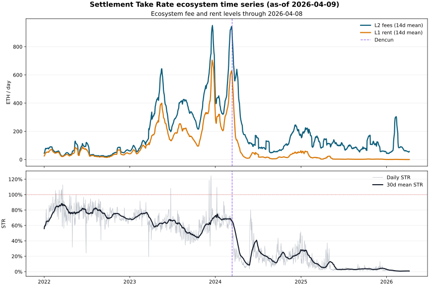
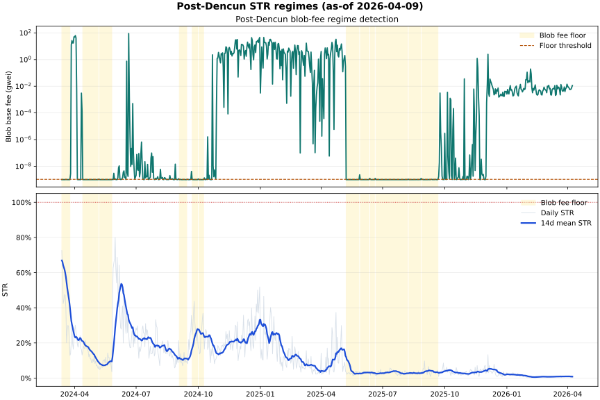

## Abstract

This paper documents the current release-candidate estimate of Ethereum rollup Settlement Take Rate (STR), the share of rollup fee revenue paid back to Ethereum L1 as settlement rent. The evidence bundle uses validated local artifacts as of `2026-04-09` and spans `{{value:panel_rollup_count}}` rollups over `{{value:panel_date_count}}` daily observations from `2022-01-01` through `2026-04-08` [@project_contract; @rollup_panel_validation]. On the locked regime table, mean ecosystem STR is `{{value:pre_dencun_mean_str_pct}}` before Dencun and `{{value:post_dencun_mean_str_pct}}` after Dencun, with a lower `{{value:post_dencun_blob_floor_mean_str_pct}}` mean during post-Dencun blob-fee-floor runs [@protocol_lock; @str_regime_summary]. The manuscript is intentionally downstream of repo contracts and validation outputs: it reports the current validated surface, documents provenance, and records remaining release caveats instead of redefining metrics in prose.

## Research Question

The repository's locked project question is whether Ethereum L1's settlement take rate on rollup economics is rising, stable, or decaying as L2 usage scales [@project_contract]. The primary metric is Settlement Take Rate (STR), defined in the protocol as

`STR_t = (sum_i RentPaid_{i,t}) / (sum_i L2Fees_{i,t})`

where `RentPaid` is the authoritative on-chain estimate of rollup payments to Ethereum L1 and `L2Fees` comes from the locked vendor denominator surface [@protocol_lock]. The current validated evidence supports a specific descriptive answer: ecosystem STR decays sharply after the Dencun boundary on `2024-03-13`, even though rollup fee activity remains substantial [@protocol_lock; @str_regime_summary].

## Data And Protocol

This draft uses only durable local artifacts already produced upstream of the paper layer. The core empirical inputs are the canonical rollup panel, the daily L1 rent decomposition, the validation bundle, and the W6 release figures/table [@rollup_panel_validation; @l1_rent_decomposition_validation; @cross_source_reconciliation; @str_ecosystem_timeseries; @str_post_dencun_regimes; @str_regime_summary].

Four protocol rules matter most for interpreting the paper [@protocol_lock]:

- STR is computed daily in ETH-native units.
- A panel row exists only when both `l2_fees_eth` and `rent_paid_eth` are present.
- Dates on or after `2024-03-13` are post-Dencun.
- Blob-fee-floor runs are post-Dencun stretches of at least `{{value:blob_fee_floor_min_consecutive_days}}` consecutive days where blob base fee stays within `{{value:blob_fee_floor_threshold_multiplier}}` the post-Dencun minimum [@protocol_lock].

On the validated `2026-04-09` surface, the authoritative panel contains `{{value:panel_row_count}}` rollup-day rows across `{{value:panel_rollup_count}}` rollups and `{{value:panel_date_count}}` dates, while the decomposition covers the full `2022-01-01` through `2026-04-08` daily window [@rollup_panel_validation; @l1_rent_decomposition_validation]. The manuscript therefore treats the release figures and regime table as direct downstream artifacts of the locked analysis path rather than restating results from untracked calculations.

## Validation

All three upstream validation reports currently pass on the same `2026-04-09` as-of surface [@rollup_panel_validation; @l1_rent_decomposition_validation; @cross_source_reconciliation]. The locked checks establish three distinct claims.

First, the authoritative panel and the rent-component surface satisfy schema, primary-key, and non-null requirements, and the component identities reconcile exactly to canonical `rent_paid_eth` under both tx-family and fee-class decompositions [@rollup_panel_validation]. Second, daily summed components match `daily_l1_rent_decomposition.l1_total_rent_eth` within the locked tolerance over all `{{value:panel_date_count}}` dates [@l1_rent_decomposition_validation]. Third, canonical and vendor panels share full matched-key coverage, show no material unexplained rollup divergences, and differ by only about `{{value:reconciliation_aggregate_rent_difference_pct}}` in aggregate rent over the full matched slice [@cross_source_reconciliation].

The validation bundle still carries one documented non-gating residual worth keeping visible in release prose: in `2025-05`, authoritative monthly rent is `{{value:reconciliation_2025_05_authoritative_rent_eth}}` versus `{{value:reconciliation_2025_05_vendor_rent_eth}}` in the vendor benchmark, a `{{value:reconciliation_2025_05_pct_difference}}` gap on a low-rent month [@cross_source_reconciliation; @release_output_caveats]. Under the locked benchmark policy, that remains diagnostic context rather than grounds to overwrite canonical rent or block the paper source.

## Results

Figure @fig-ecosystem-str shows the ecosystem time series built from the validated panel surface. The series makes the main qualitative result easy to see: pre-Dencun STR is frequently elevated, while post-Dencun STR is structurally lower even when L2 fees remain meaningful [@str_ecosystem_timeseries]. The accompanying regime table quantifies that break. Mean ecosystem STR falls from `{{value:pre_dencun_mean_str_pct}}` before Dencun to `{{value:post_dencun_mean_str_pct}}` after Dencun, while mean daily rent drops from `{{value:pre_dencun_mean_rent_paid_eth}}` to `{{value:post_dencun_mean_rent_paid_eth}}` [@str_regime_summary].

{#fig-ecosystem-str fig-alt="Daily ecosystem Settlement Take Rate with smoothed L2 fees, smoothed L1 rent, and the Dencun boundary."}

Figure @fig-post-dencun-regimes focuses on the post-Dencun sample and shades the protocol-defined blob-fee-floor runs [@protocol_lock; @str_post_dencun_regimes]. The table shows that mean STR is `{{value:post_dencun_blob_floor_mean_str_pct}}` during blob-fee-floor periods versus `{{value:post_dencun_non_floor_mean_str_pct}}` in the rest of the post-Dencun sample [@str_regime_summary]. On the current validated surface, the simplest answer to the project's primary question is therefore not "rising" or "stable" but "decaying after the Dencun regime change," with the cheapest blob-fee conditions coinciding with the lowest observed ecosystem rent take rates.

{#fig-post-dencun-regimes fig-alt="Post-Dencun daily Settlement Take Rate, 14-day mean STR, and shaded blob fee floor periods."}

### Regime Summary Table

The locked W6 regime table is included directly from the durable table surface so the manuscript and release bundle reference the same artifact.



## Evidence table

| Reported result | Evidence surface |
|---|---|
| Pre-/post-Dencun STR regime means | `reports/tables/str_regime_summary.md` |
| Ecosystem STR time series | `reports/figures/str_ecosystem_timeseries.svg` |
| Panel and rent-component identities | `reports/validation/rollup_panel_validation.md` |
| Canonical/vendor reconciliation | `reports/validation/cross_source_reconciliation.md` |

## Alternative explanations considered

The observed regime difference may reflect denominator coverage and source-specific measurement differences in addition to the Dencun boundary. The denominator-keyed inclusion rule and the documented `2025-05` vendor gap are therefore retained as limitations rather than resolved as causal alternatives by this descriptive release.

## Uncertainty statement

The reported values are validated descriptive summaries of the committed panel, not causal estimates. Their scope is limited by the locked sample construction, missing-denominator exclusions, and the source-reconciliation residuals described above.

## Provenance And Limitations

This manuscript is downstream of the locked repository control plane, not a parallel analysis channel. Protocol definitions come from `docs/protocol.md`, project-level release requirements come from `contracts/project.yaml`, and the empirical claims quoted here are limited to validated report artifacts and their provenance manifests [@protocol_lock; @project_contract; @rollup_panel_validation; @l1_rent_decomposition_validation].

Two limitations matter for interpretation. First, the authoritative panel is intentionally denominator-keyed: rollup-days missing vendor fee denominators are omitted from STR aggregation even when rent-component data exists. The current validated surface therefore has `{{value:panel_row_count}}` panel rows but `{{value:rent_component_row_count}}` rent-component rows, and the component-to-decomposition identity is the correct full-rent coherence check [@rollup_panel_validation; @release_output_caveats]. Second, this task owns manuscript source only. Final rendered artifacts, release manifests, and catalog updates remain Operator-owned T080 surfaces.

Within those limits, the paper source is release-aligned: it uses the locked filenames, cites only durable local artifacts, and can be rendered by Quarto without inventing new evidence or changing scientific definitions.
